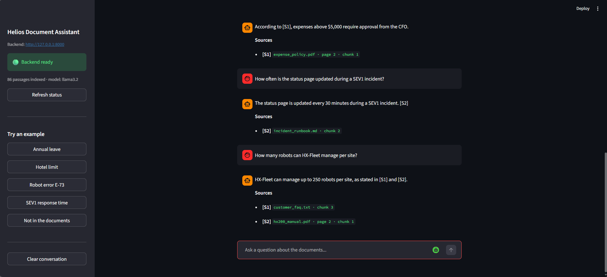
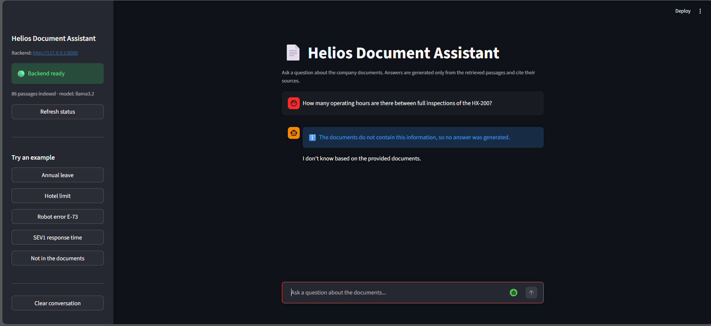
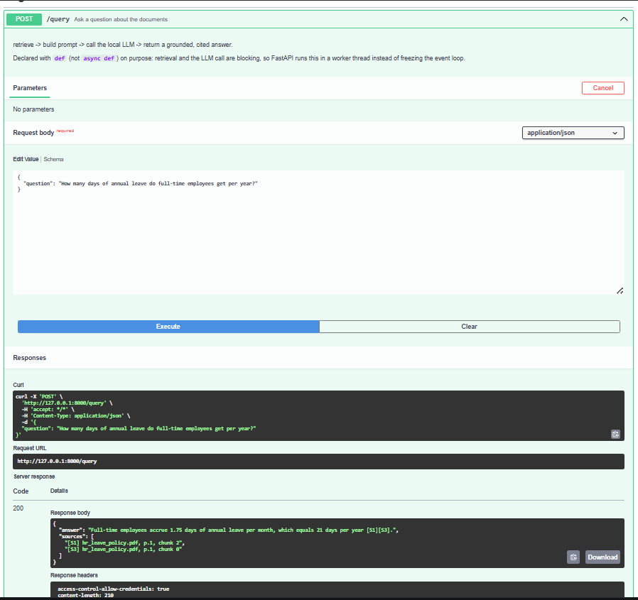
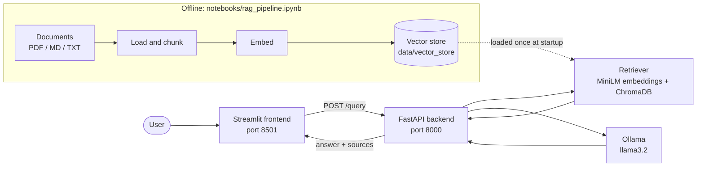

# Helios Document Assistant: a RAG-powered Q&A app over company documents

Ask questions in a chat interface and get answers generated by a **local LLM** strictly from your documents, with **citations** that point to the exact file, page and passage. If the documents do not contain the answer, the assistant says so instead of guessing.

> **Track:** Core (text-only RAG). Everything runs locally: [Ollama](https://ollama.com) for the language model, ChromaDB for the vector store, no cloud API and no API keys.








## Table of contents
[Architecture](#architecture) · [How it works](#how-it-works) · [Tech stack](#tech-stack) · [Project structure](#project-structure) · [Domain and data](#domain-and-data) · [Getting started](#getting-started) · [Configuration](#configuration) · [API reference](#api-reference) · [Evaluation results](#evaluation-results) · [Tests](#tests) · [Docker](#docker) · [Limitations and future work](#limitations-and-future-work)

## Architecture



## How it works
1. **Load and inspect:** PDFs (page by page with `pypdf`), Markdown and text files are loaded; files that fail to parse are reported, never silently dropped.
2. **Chunking:** fixed-size chunks of 800 characters with 150 characters of overlap, snapped to word boundaries. Every chunk keeps its source file, page and position.
3. **Embeddings and vector store:** `sentence-transformers/all-MiniLM-L6-v2` (384 dimensions) and a persistent **ChromaDB** collection using cosine similarity. The store and its settings (`config.json`) are saved to disk, so the backend loads them without rebuilding anything.
4. **Retrieval:** the question is embedded with the same model and the 5 most similar chunks are retrieved. If even the best chunk is below a similarity threshold (0.25), the LLM is not called and the assistant answers that it does not know.
5. **Grounded generation:** the chunks are numbered `[S1]`...`[S5]` in the prompt. The system prompt allows only the provided context, requires an `[S#]` citation for every claim and defines an exact refusal sentence. The LLM (`llama3.2`, temperature 0) writes the answer.
6. **Citation check:** the backend validates the `[S#]` tags against the retrieved chunks and returns them as readable sources (`file, page, chunk`).

## Tech stack
| Layer | Technology |
|---|---|
| Document parsing | `pypdf` |
| Embeddings | `sentence-transformers` (`all-MiniLM-L6-v2`) |
| Vector database | ChromaDB (persistent, cosine) |
| LLM | Ollama, `llama3.2` (local) |
| Backend | FastAPI, Pydantic, Uvicorn |
| Frontend | Streamlit |
| Notebook and evaluation | Jupyter, pandas, numpy |
| Tests | pytest (backend: 36, frontend: 33) |

## Project structure
```
rag-assistant-app/
├── README.md
├── .gitignore
├── notebooks/
│   └── rag_pipeline.ipynb        # load -> chunk -> embed -> retrieve -> generate -> evaluate -> export
├── data/
│   ├── documents/                # the 10 source documents (5 PDF, 2 MD, 3 TXT)
│   ├── vector_store/             # config.json + chroma/  (written by the notebook, read by the backend)
│   └── evaluation_results.csv    # results table exported by the notebook
├── backend/                      # FastAPI service (port 8000)
│   ├── app/
│   │   ├── main.py               # app, CORS, startup loading (lifespan)
│   │   ├── api/routes/query.py   # GET /health, POST /query
│   │   ├── core/config.py        # settings from .env
│   │   ├── schemas/query.py      # QueryRequest / QueryResponse
│   │   ├── services/retrieval.py # load the vector store, retrieve chunks
│   │   ├── services/generation.py# prompt, Ollama call, citations
│   │   └── utils/logging_config.py
│   ├── tests/
│   ├── run.py                    # one-command launcher
│   ├── requirements.txt
│   ├── .env.example
│   └── Dockerfile
├── frontend/                     # Streamlit app (port 8501)
│   ├── app.py
│   ├── api_client.py             # wrapper around the backend API
│   ├── run.py
│   ├── requirements.txt
│   ├── .env.example
│   └── tests/
└── docs/
    ├── test_questions_and_answers.md
    └── screenshots/
```

## Domain and data
The domain is the **internal knowledge base of a fictional robotics company, Helios Robotics** (warehouse robot *HX-200*): HR and finance policies, the robot's operator manual, warranty and support terms, security and incident procedures, an engineering handbook, onboarding guide, customer FAQ and remote-work policy.

| Area | Documents |
|---|---|
| HR and finance | `hr_leave_policy.pdf`, `expense_policy.pdf`, `onboarding_guide.txt`, `remote_work_policy.txt` |
| Product | `hx200_manual.pdf`, `warranty_and_support.pdf`, `customer_faq.txt` |
| Engineering and security | `engineering_handbook.md`, `incident_runbook.md`, `security_policy.pdf` |

- **10 documents, 3 formats, about 8,600 words**, which produce 20 page/section records and 86 chunks. All PDFs have a text layer (no OCR needed).
- **The corpus is synthetic.** The documents were written for this project and every fact in them is invented. That is deliberate: the model cannot answer from its own training data, so a correct answer must come from retrieval, and a made-up answer is easy to spot.
- Several numbers and phrases appear in more than one document (for example "within 1 hour" or "500"), and each PDF page carries a header/footer line. These make retrieval realistically harder.
- The corpus and the vector store are small, so both are **committed to the repository** and the app runs right after cloning. To use your own documents, replace the files in `data/documents/` and run the notebook again.

## Getting started

### Prerequisites
- **Python 3.10 or newer** (`python --version`)
- **[Ollama](https://ollama.com/download)** installed and running
- **Git**
- About 3 GB of free disk space (Python packages, the `llama3.2` model, the embedding model)

### 1. Clone and get the language model
```bash
git clone https://github.com/a7met-eltony/rag-assistant-app.git
cd rag-assistant-app
ollama pull llama3.2
```

### 2. Start the backend (terminal 1)
```bash
cd backend
python run.py
```
The first run creates a virtual environment and installs the packages (a few minutes). The launcher checks that the vector store, Ollama and the port are ready, then starts the API. Wait for `Application startup complete`, then open <http://127.0.0.1:8000/health>: it should show `"status": "ok"`.

> Already have the packages in your Python (for example from running the notebook)? Use `python run.py --no-venv`.

### 3. Start the frontend (terminal 2)
```bash
cd frontend
copy .env.example .env        # macOS/Linux: cp .env.example .env
python run.py
```
The browser opens <http://127.0.0.1:8501>. Ask a question, or click one of the examples in the sidebar.

### 4. (Optional) Rebuild the vector store
`data/vector_store/` is already committed. To rebuild it (for example with your own documents), open `notebooks/rag_pipeline.ipynb`, choose **Kernel > Restart & Run All**, and restart the backend afterwards. The notebook needs the same Python packages plus Jupyter (`pip install jupyter pandas numpy chromadb sentence-transformers pypdf ollama`).

### Troubleshooting
| Symptom | Fix |
|---|---|
| Sidebar says the backend is not reachable | Start the backend first (step 2) and click **Refresh status** |
| `/health` says `degraded` | Read the `detail` field: Ollama not running, model not pulled (`ollama pull llama3.2`), or vector store missing |
| Port already in use | Another copy is running; close it or start with `python run.py --port 8001` |
| The first answer is slow | The local model is loading into memory; later answers take a few seconds |

## Configuration

**Backend** (`backend/.env`, optional; copy `.env.example`). Nothing needs to be changed for the layout above.

| Variable | Default | Meaning |
|---|---|---|
| `OLLAMA_HOST` | `http://127.0.0.1:11434` | Ollama server (use `127.0.0.1`: on Windows `localhost` may resolve to IPv6) |
| `OLLAMA_MODEL` | from `config.json` (`llama3.2`) | Model used for answers |
| `OLLAMA_TIMEOUT` | `120` | Seconds to wait for the LLM |
| `TEMPERATURE` / `NUM_CTX` | `0.0` / `4096` | Generation settings |
| `TOP_K` | from `config.json` (`5`) | Number of chunks sent to the LLM |
| `MIN_SIMILARITY` | from `config.json` (`0.25`) | Below this, the assistant refuses without calling the LLM |
| `VECTOR_STORE_DIR` | auto-detected | Force a vector store folder |
| `CORS_ORIGINS` | Streamlit and Gradio on localhost | Allowed frontend origins (comma-separated) |
| `LOG_LEVEL` | `INFO` | Logging level |

**Frontend** (`frontend/.env`, required; copy `.env.example`).

| Variable | Default | Meaning |
|---|---|---|
| `API_BASE_URL` | `http://127.0.0.1:8000` | Backend address. Read from the environment; never hard-coded |
| `REQUEST_TIMEOUT_SECONDS` | `150` | How long to wait for an answer |

## API reference
Interactive documentation (Swagger UI): <http://127.0.0.1:8000/docs>

### `GET /health`
Always answers 200. `status` is `ok` when the vector store is loaded, Ollama is reachable and the model is installed; otherwise `degraded` with a `detail` explaining why.

### `POST /query`
Request body: `{"question": "<text>"}` (1 to 1000 characters, not blank).

```bash
curl -X POST http://127.0.0.1:8000/query \
     -H "Content-Type: application/json" \
     -d '{"question": "How many days of annual leave do full-time employees get per year?"}'
```
On Windows PowerShell use `curl.exe` (plain `curl` is an alias of another command) or:
```powershell
Invoke-RestMethod -Method Post -Uri http://127.0.0.1:8000/query -ContentType "application/json" `
  -Body '{"question": "How many days of annual leave do full-time employees get per year?"}'
```

Response (a real answer from the evaluation run):
```json
{
  "answer": "Full-time employees accrue 1.75 days of annual leave per month, which equals 21 days per year [S1][S3].",
  "sources": [
    "[S1] hr_leave_policy.pdf, p.1, chunk 2",
    "[S3] hr_leave_policy.pdf, p.1, chunk 0"
  ]
}
```
When the documents do not contain the answer: `"answer": "I don't know based on the provided documents."` and `"sources": []`.

| Status | Meaning |
|---|---|
| 200 | Answer returned |
| 422 | Invalid input (missing, empty, blank or too long question) |
| 502 | Ollama returned an error |
| 503 | Ollama is not reachable, the model is not pulled, or the vector store is not loaded |

## Evaluation results
Section 2.6 of the notebook evaluates the pipeline on **13 questions**: 11 whose answer is in the documents and 2 that are deliberately not (to test refusal). A question counts as *correct* only if the answer contains the expected fact **and** cites a chunk of the expected source file. The expected answers are listed in [`docs/test_questions_and_answers.md`](docs/test_questions_and_answers.md).

| Metric | Result |
|---|---|
| Correct answers | **12 / 13 (92.3%)** |
| Hallucinated answers | **0** |
| False refusals (answer existed but was not found) | 1 |
| Correct refusals on unanswerable questions | 2 / 2 |
| Right source retrieved, answerable questions | 10 / 11 (90.9%) |
| Median latency per question (local `llama3.2`) | 2.9 s |

| # | Question | Top retrieved source (similarity) | Answer | Result |
|---|---|---|---|---|
| 1 | How many days of annual leave do full-time employees get per year? | `hr_leave_policy.pdf`, p.1 (0.56) | Full-time employees accrue 1.75 days of annual leave per month, which equals 21 days per year [S1][S3]. | **Correct** |
| 2 | What is the maximum nightly hotel cost in Tier-1 cities such as New York, London and Singapore? | `expense_policy.pdf`, p.1 (0.80) | The maximum nightly hotel cost in Tier-1 cities, such as New York, London, and Singapore, is \$260 per night, as stated in [S1] (page 1). | **Correct** |
| 3 | How many operating hours are there between full inspections of the HX-200? | `engineering_handbook.md` (0.54) | I don't know based on the provided documents. | **Missed (false refusal)** |
| 4 | Within how many hours must a critical vulnerability be patched? | `security_policy.pdf`, p.3 (0.55) | According to [S1], critical vulnerabilities must be patched within 72 hours. | **Correct** |
| 5 | How quickly must the on-call engineer respond to a SEV1 incident? | `incident_runbook.md` (0.73) | Within 15 minutes; acknowledge the page within 5 minutes [S1]. | **Correct** |
| 6 | How long is the standard warranty for the HX-200? | `warranty_and_support.pdf`, p.3 (0.67) | The standard warranty for the HX-200 is 24 months from the delivery date, as stated in [S1] and [S2]. | **Correct** |
| 7 | What is the list price of one HX-200 robot? | `customer_faq.txt` (0.67) | The list price of one HX-200 robot is \$24,500 per robot, excluding taxes, freight, and optional accessories. [S1] | **Correct** |
| 8 | What minimum test coverage is required for new code? | `engineering_handbook.md` (0.57) | The minimum test coverage required for new code is 80%. [S1][S2] | **Correct** |
| 9 | How many days per year may an employee work remotely from another country? | `remote_work_policy.txt` (0.63) | According to [S1], an employee may work remotely from another country for up to 20 days per calendar year. | **Correct** |
| 10 | How long is the probation period for new hires? | `onboarding_guide.txt` (0.69) | The probation period for new hires is 6 months, with a review after 3 months and a final review at the end of month 6. [S1] | **Correct** |
| 11 | How quickly must a lost or stolen laptop be reported to the security team? | `security_policy.pdf`, p.3 (0.67) | According to [S1], employees who report incidents in good faith are never penalized, and a lost or stolen laptop must be reported to the security team withi... | **Correct** |
| 12 | What is the annual salary of the CEO of Helios Robotics? | `hr_leave_policy.pdf`, p.1 (0.53) | I don't know based on the provided documents. | **Correct** |
| 13 | Under which stock ticker symbol is Helios Robotics publicly traded? | `hx200_manual.pdf`, p.2 (0.48) | I don't know based on the provided documents. | **Correct** |

**Failure analysis.** The single failure (Q3) is a *retrieval miss*: the chunk of the HX-200 manual that states the 500-hour inspection interval was not among the 5 retrieved chunks (the question's words also occur in the warranty terms, FAQ and handbook, and the embedding model ranked those overview passages higher). With no evidence in the prompt, the model correctly refused instead of guessing, so the system failed *safely*. Q11 was graded correct but its answer opened with an unrelated sentence copied from the same chunk. Mitigations in place: temperature 0, a strict prompt with an exact refusal sentence, a similarity threshold, and citation validation. Next steps: a larger `top_k`, hybrid keyword + embedding retrieval, a reranker and section-based chunking. The full discussion is in the notebook (section 2.6).

## Tests
```bash
cd backend  && python run.py --test     # 36 tests
cd frontend && python run.py --test     # 33 tests
```
The tests need neither Ollama nor the vector store. Backend tests cover both endpoints, input validation (422), error handling (502/503), the similarity threshold, citation parsing and vector store detection. Frontend tests talk to a real local HTTP server (timeouts, connection errors, malformed replies) and drive the real UI headlessly (answers with sources, refusals, errors, example buttons).

## Docker
The backend image contains the vector store, so copy it into the backend folder first (from the repository root):
```powershell
xcopy /E /I data\vector_store backend\data\vector_store     # macOS/Linux: cp -r data/vector_store backend/data/
cd backend
docker build -t rag-backend .
docker run -p 8000:8000 rag-backend
```
Ollama keeps running on the host machine (the image points to `http://host.docker.internal:11434`; on Linux add `--add-host=host.docker.internal:host-gateway`).

## Limitations and future work
- The corpus is small and synthetic; results on large, messy real-world collections will differ.
- 13 evaluation questions are a smoke test, not a benchmark.
- Plain dense retrieval can miss passages whose key terms are spread over several documents (see Q3). Hybrid retrieval and a reranker are the next improvements.
- Scanned PDFs need OCR before they can be indexed.
- The app answers one question at a time; it does not use earlier turns of the conversation.
